---
title: "Introduction à R"
subtitle: "Statistique descriptive univariée et bivariée"
date: "Master G2M, 6-8 septembre 2021"
author: 
 - name: Hugues Pecout
   affiliation: FR CIST, CNRS
 - name: Timothée Giraud
   affiliation: UMS RIATE, CNRS
image: "featured.png"   
logo: "figures/rzine.png"  
output:
  rzine::readrzine:
    highlight: kate
    number_sections: true
csl: Rzine_citation.csl
css: style_new.css
bibliography: biblio.bib
nocite: |
  @*
link-citations: true
licence: "[](https://creativecommons.org/licenses/by-sa/4.0)"
giturl: "[](https://github.com/HuguesPecout/Initiation_R_stats)"
#doi: "[](https://doi.org/xxx)"
--- 

```{r klippy, echo=FALSE, include=TRUE}

options("scipen" = 10)
```

<br/>

<div class="alert alert-danger" role="alert">
<center>**Objectifs de ce cours**</center> 
<br/>
**1) Acquérir les bases du logiciel/language R et de son environnement RStudio**<br/> 
**2) Réviser les bases de la statistique descriptive univariée et bivariée en géographie**<br/>
**3) Comprendre les atouts de R pour la gestion, l'analyse et la représentation de données**
</div>


<br/>

**Avant de démarrer la pratique, nous allons introduire la logicel/langage R et l'IDE Rstudio**. Pour cela, nous utiliserons deux diaporamas :

-> Partie 1 : [Contextualisation et présentation de R et Rstudio](https://huguespecout.github.io/R_presentation_FR/#/)   
-> Partie 2 : [Base du langage, packages, Rstudio et documentation](https://huguespecout.github.io/Intro_R_Rstudio_FR/#/)

<br/>

```{r warning=FALSE, message=FALSE, eval=TRUE, include= TRUE, echo=FALSE}

library('rvest')
url <- "https://cran.r-project.org/web/packages/available_packages_by_date.html"
#Reading the HTML code from the website
webpage <- read_html(url)
td <- webpage %>%  html_nodes("td")
rank_data <- html_text(td)

vec <- c(NULL)
for (t in seq(1,length(rank_data),3))  {
vec <-  c(vec, rank_data[t])
}

library(stringr)
vec <- str_trim(vec)
test <- as.data.frame(vec)
test$nb <- 1
test$date <- as.Date(test$vec)
test <- test[,c(3:2)]

library(plyr)
test2 <-  ddply(test, .(date), summarize, nb=sum(nb))
test2$cum <- cumsum(test2$nb)
test <- test2[,c(1:3)]

nb_function_base <- length(c(lsf.str("package:base"), lsf.str("package:graphics"), lsf.str("package:grDevices"), lsf.str("package:methods"), lsf.str("package:stats"), lsf.str("package:utils")))

```


# Prise en main

<br/>

## L'interface Rstudio

**L'interface de RStudio se présente sous la forme d’une unique fenêtre découpée en quatre zones** que l’on peut redimensionner, masquer ou maximiser selon ses préférences :

<li>L’éditeur de code</li> 
Cette zone permet l’édition de fichiers source R (avec coloration syntaxique et autocomplétion).

<li>La console</li>
La console avec la session R en cours d’exécution. La console affiche à la fois le code exécuté, ses résultats associés, ainsi que les avertissements (warnings) et messages d'erreur éventuels (errors). 

<li>L’espace de travail</li>
Cette zone permet de lister, typer et visualiser les objets créés par l'exécution du code R.

<li> Une quatrième zone pemettant de basculer entre :</li>
Un explorateur de fichiers, une fenêtre graphique, une fenêtre de gestion des packages et de la documentation associée aux fonctions et packages.


<p class="center">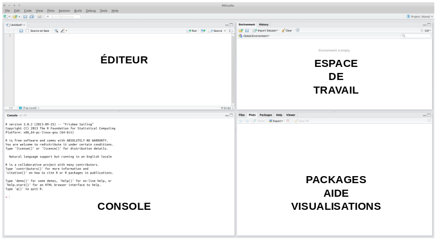
</p>


<br/>

**RStudio propose de nombreuses fonctionnalités intéressantes, par exemple : **


<ul>
<li>La création de projet</li> 

RStudio dispose d’une fonctionnalité très pratique pour **organiser son travail en différents projets**. L’idée principale est de réunir tous les fichiers et documents relatifs à un même projet (que ce soit les données, les scripts, les rapports automatisés…) dans un répertoire dédié. L’onglet Projects est situé en haut à droite de l’interface.


<li>Les boutons raccourcis</li> 

**Plusieurs actions** comme la création et le chargement de programme, l'import de données, l'installation et le chargement de packages, l'accés à la documentation, la visualisation des objets, l'export de figures... **sont exécutables en un simple clic**.


<li>L'autocomplétion</li>

RStudio présente aussi la capacité de compléter automatiquement les termes en cours d’écriture.  **L’autocomplétion  fonctionne  avec  la  touche Tab du  clavier**. Cela aide l'utilisateur dans la saisi des noms d'objet, de fonction, de variable, et même des arguments de fonction.


<li>Raccourcis clavier</li>

RStudio propose de nombreux raccourcis clavier intéressants, exemple : 

- `Alt` + `-` renvoie l’opérateur d’assignation accompagné d’un espace avant et un espace après (<-)   
- `Ctrl` + `Entrée` exécute le code écrit dans la fenêtre d’édition (script)
- `Ctrl` + `1` et `Ctrl` + `2` permettent de passer de la console à l’éditeur de code et vice versa   
- `shift`+`alt`+`k` pour accéder à l'ensemble des raccourcis. 

<br/>


## Paramètres généraux

Pour éviter des problèmes d'encodage des scripts ou le chargement incessant de données à chaque nouvelle instance de Rstudio, **il est necessaire de modifier certains paramètres globaux**. Pour cela, cliquez sur *tools* puis sur *Global Options* pour ouvrir la fenêtre des paramètre généraux de Rstudio. 


Dans un premier temps, **décochez les options de restoration et de sauvegarde de données** à l'ouverture et à la fermeture de session :

<p class="center">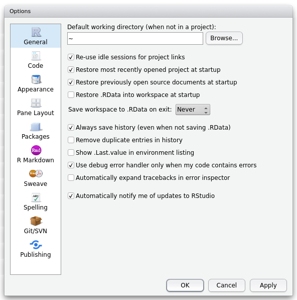
</p>

<br/>

Puis, dans l'onglet *code* et le sous-onglet *saving*, **paramétrez l'encodage en UTF-8** pour que les scripts crées s'affichent correctement en cas d'ouverture dans un autres systèmes d'exploitation :

<p class="center">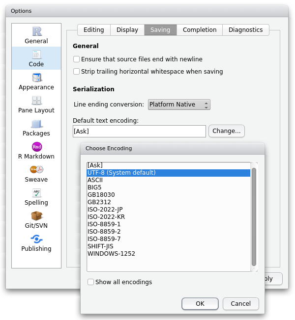
</p>

<br/>


## Les projets

Cette fonctionnalité permet d'organiser son travail en différents projets. L’idée principale est de réunir tous les fichiers relatifs à un même projet (quelque soit leur format) dans un répertoire dédié. **Le menu "Project" est accessible via une icône dédiée située tout en haut à droite** :

<br/>

<p class="center">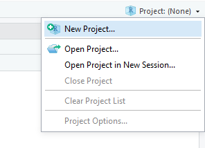
</p>

<br/>

Dans le menu **Project**, sélectionnez l’option **New project** :

<br/>

<p class="center">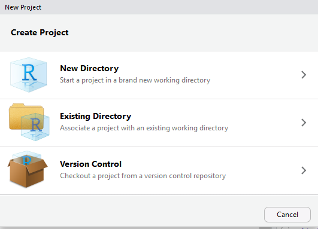
</p>

<br/>

Dans un nouveau répertoire, créez un projet vide. Indiquez le nom de votre projet, qui sera également le nom du répertoire créé pour stocker les données du projet. Puis, indiquez le répertoire parent, dans lequel votre projet sera créé :

<br/>

<p class="center">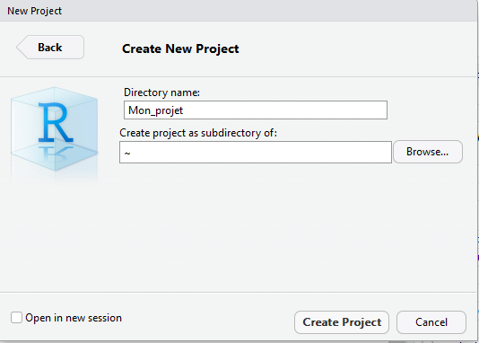
</p>

<br/>


## Les objets

Tout ce qui est créé et manipulé sous R est un objet. Ces objets permettent de stocker et de structurer les données.    
Les objets peuvent stocker différents types de données. Voici les principaux :

- La chaine de caractères (*string*)    

Il s'agit d'une suite ordonnée de caractères. Ex : *"Ma chaîne de caractères"* ou "*234*"


- Nombre entier (*integer*)    

Il s'agit d'un nombre sans décimale (sans virgule). Ex : *347*


-  Nombre réel (*numeric*)   

Il s'agit d'un nombre décimale. Ex : *86.6*


- Valeur logique ou booléenne (*logical*)   

Une variable booléenne est une variable qui ne prend que deux valeurs : *true* (vrai) et *false* (faux) ou *O* et *1*

<br/>


### Créer un objet

Un objet peut être créé avec l'opérateur « assigner » (`<-`), une flèche composée du signe inférieur (`<`) accolé à un tiret (`-`). Si l'objet existe déjà, sa valeur précédente est remplacée par la nouvelle. La valeur renvoyée peut être le résultat d'une opération et/ou d'une fonction :

```{r class.source="bg-info", class.output="bg-warning", warning=FALSE, message=FALSE}
n <- "chaîne de caractères"
n
n <- 15 + 9
n

```

**On peut également écrire une expression sans assigner son résultat ou sa valeur à un objet**, le résultat est alors affiché à l'écran mais n'est pas stocké dans un objet en mémoire :

```{r warning=FALSE, message=FALSE}

(10 + 2) * 5

# Pour enregister le résultat en mémoire, on l'assigne dans un objet, ex :
Mon_objet <- (10 + 2) * 5

```


<br/>

### La fonction

Le logiciel R dispose de fonctions préprogrammées appelées fonctions primitives ou basiques et regroupés dans le package <span style="color:#4B0082">base</span> qui est automatiquement chargé. Pour connaître toutes les fonctions primitives, utilisez la fonction <span style="color:#8C001A">library(help = "base")</span> :

```{r warning=FALSE, message=FALSE}

library(help = "base")

# Quelques exemples...

# class()           Connaitre la classe de données d'un élément
# as.character()    Assigner la class 'caractere' à un élement
# is.numeric()      Tester si un élément est numéric (réponse TRUE ou FALSE) 
# paste()           Coller des chaine de caractère
# unlist()         permet de transformer une liste en vecteur

```

**Pour utiliser une fonction, il suffit d'écrire son nom, puis de spécifier des arguments entre parenthése**. 

Exemple de <span style="color:#8C001A">fonctions</span> permettant d'assigner ou de modifier la classe d'un objet :

```{r warning=FALSE, message=FALSE, eval=FALSE}

# Les différentes fonctions permettant de modifier la classe de l'objet 'mon_objet' :
as.vector(x='mon_objet')
as.data.frame(x='mon_objet')
as.matrix(x='mon_objet')
as.array(x='mon_objet')
as.list(x='mon_objet')
as.factor(x='mon_objet')

```

```{r warning=FALSE, message=FALSE, eval=TRUE}

# Exemple
mon_objet <- "20345"

class(mon_objet)

mon_objet <- as.numeric(mon_objet)

class(mon_objet)

```


Dans la plupart des cas, les arguments d'une fonction sont prédéfinis. Il est donc important de **se renseigner sur les différents arguments d'une fonction et ses valeurs paramétrées par défault**. Attention, certains arguments n'ont pas de valeur prédéfinie mais doivent obligatoirement être renseigné.

Exemple avec la fonction <span style="color:#8C001A">mean()</span> :


```{r warning=FALSE, message=FALSE, eval=TRUE}

notes <- c(11,13,15,17,10,8,14,13,12,15,19,NA)

# Il est évidemment obligatoire de spécifier le vecteur de valeurs sur lequel on calcul une moyenne !
mean(notes)

```

La fonction <span style="color:#8C001A">mean()</span> retourne NA car la série statistique présente une valeur manquante (NA). **L'arguments na.rm (= FALSE par défault) permet de ne pas prendre en compte les valeurs manquantes** :

```{r warning=FALSE, message=FALSE, eval=TRUE}

# na.rm (= FALSE par défault) permet de prendre en compte ou non les valeurs NA
mean(notes, na.rm = TRUE)

```

L'utilisateur a  également la possibilité de définir ses propres fonctions. 
Une fonction est mise dans une variable contenant un bloc d'instructions introduit par la commande <span style="color:#8C001A">function()</span>. La syntaxe générale est :

```{r warning=FALSE, message=FALSE}

nom_de_fonction <- function(arguments) { instructions }

```

Exemple :

```{r warning=FALSE, message=FALSE}

# Ecriture une fonction
carre <- function(x) {
  y <- x*x
  return(y)
}

# Pour afficher le code source d'une fonction (non primitive), 
# écrire son nom sans parenthèse :
carre

# Utiliser une fonction :
# fonction(argument1=... , argument2=..., argument3=..., ... )

# Exemple :
# carre(x=3) ou plus simplement :
carre(3)

```

Si vous souhaitez utiliser une fonction issue d'un package spécifique, vous devez d'abord installer le package et chargez la library :

```{r warning=FALSE, message=FALSE, eval=FALSE}

# Installation du package
install.packages("foreign")

# Chargement de la library
library(foreign)

# Utilisation de la fonction read.dbf() de la library "foreign"
# L'argument as.is permet de convertir ou non les vecteurs en facteurs
read.dbf("D:/users/geographie/Documents/nom_fichier.dbf", as.is = FALSE)

```

<br/>

### Le vecteur

**Un vecteur permet de regrouper des éléments d'une même classe**.

```{r warning=FALSE, message=FALSE }

# Joindre des éléments dans un vecteur
mon_vecteur <- c(1,2,3,4,5,6,7,8,9)
mon_vecteur <- c("A","B","C","D","E")
mon_vecteur <- c("nom", "prenom", 10, 20.78, TRUE)
mon_vecteur

# Créer une séquence complexe dans un vecteur
mon_vecteur <- c(seq(2, 3, by=0.5))
mon_vecteur

# Répeter un vecteur
mon_vecteur <- c(rep(1:2, times=3))
mon_vecteur

# Répeter chaque éléments
mon_vecteur <- c(rep(1:2, each=3))
mon_vecteur

# Créer un séquence de nombre entier
mon_vecteur <- c(1:7)
mon_vecteur

# Ajouter un element à un vecteur
mon_vecteur_new <- c(mon_vecteur, "Un Element Supplémentaire")

# Interroger les élements d'un vecteur -> mon_vecteur[element]
# Elément 2
mon_vecteur[2]
# Eléments 2 à 4
mon_vecteur[2:4]
# Eléments 2 et 5
mon_vecteur[c(2,5)]


```

<br/>

### Le data frame

Un data frame est utilisé pour stocker une table de données. Il s'agit d'une liste de vecteurs de même longueur.

```{r warning=FALSE, message=FALSE}

# Construction de trois vecteurs
personne <- c('John Doe','Peter Gynn','Jolie Hope','John snow')
salaire <- as.integer(c(21000, 23400, 26800, 32700))
date <- as.Date(c('2010-11-1','2008-3-25','2007-3-14', '1678-1-23'))

# Construction du data.frame à partir de trois vecteurs de même longueur
mon_tableau <- data.frame(personne, salaire, date)
mon_tableau

# Ajouter une variable
mon_tableau$New_col_1 <- "mon_texte"
mon_tableau$New_col_2 <- c(1,2,3,4)
mon_tableau

# Interroger les éléments d'un tableau -> mon_tableau[ligne,colonne]
# Ligne 2
mon_tableau[2,]
# Colonnes 1 et 3
mon_tableau[,c(1,3)]
# Colonne 'personne'
mon_tableau$personne
# Ligne 4 & colonne 'personne' - method 1
mon_tableau[4,"personne"]
# Ligne 4 & colonne 'personne' - method 2
mon_tableau$personne[4]

```

<br/>

### La liste

**Une liste est un vecteur d'objets**. Il permet de stocker différents types d'objets dans un seul objet.

```{r warning=FALSE, message=FALSE}

ma_fonction <- function() {cat("hello")}
mon_vecteur1 <- c('John Doe','Peter Gynn','Jolie Hope','John snow')
mon_vecteur2 <- as.Date(c('2010-11-1','2008-3-25','2007-3-14', '1678-1-23'))
mon_tableau <- data.frame(mon_vecteur1, mon_vecteur2)

# Création d'une liste
ma_liste <- list(ma_fonction, mon_vecteur1, mon_vecteur2,mon_tableau)
ma_liste

# Ajouter un élément à une liste
ma_liste[[length(ma_liste) + 1]] <- "J'ajoute un objet à ma liste"


# Interroger les objets d'une liste -> ma_list[[élement]][sous element]
# Objet 1
ma_liste[5]
# Objets 2 et 3
ma_liste[c(2,3)]
# Tous les objets sauf le 1 et le 4
ma_liste[-c(1,4)] 
# Elément 2 de l'objet 3
ma_liste[[3]][2]


```

<br/>

### La matrice

Une matrice est un **tableau d'objet de même type, à double entrée**.

```{r warning=FALSE, message=FALSE}

ma_matrice <- matrix(c(1:16), nrow=4, ncol=4) 

# On navigue dans une matrice de la même façon que dans un data frame -> ma_matrice[ligne, colonne]
ma_matrice[4,3]

```

De nombreuses opérations et <span style="color:#8C001A">fonctions</span> primitives sont applicables à cet objet. Quelques exemples :

```{r warning=FALSE, message=FALSE}

# Multiplication de matrice, élément par élément.
ma_matrice * ma_matrice 
# Transposer la matrice
t(ma_matrice)
# Sélectionner la diagonale
diag(ma_matrice)
# Moyennes des lignes
rowMeans(ma_matrice)
# Sommes des colonnes
colSums(ma_matrice)

```


<br/>


### Le Simple Feature data frame 

**L'objet sf est en quelque sorte une table de données géographique**. Il permet de gérer de l'information spatiale. Il s'agit tout simplement d'un dataframe qui stocke également des geométries.

```{r warning=FALSE, message=FALSE}

# Création d'un vecteur de nombre (1 à 10)
ID <-seq(1:10)
# Création d'un vecteur de lettres (a à j)
name <-letters[1:10]
latitude <- c(48.84905, 48.85217, 48.83349, 48.86528, 48.86409, 48.85176, 48.85207, 48.88334, 48.85758, 48.87391)
longitude <- c(2.331454, 2.347332, 2.318518, 2.371150, 2.356515, 2.299024, 2.358712, 2.333936, 2.352751, 2.343179)

mes_donnees <- data.frame(ID, name, latitude, longitude)

library(sf)
mes_donnees_SF <- st_as_sf(mes_donnees, coords = c("longitude", "latitude"), crs = 4326, agr = "constant")
mes_donnees_SF

# Interroger un objet sf
# Fonctionne comme pour un data frame pour les différentes variables
# Colonne 'ID'
mes_donnees_SF$ID
# Colonne ID, ligne 3
mes_donnees_SF$name[3]
# Geometrie de l'entités 3
mes_donnees_SF$geometry[3]

# Affichage des geometries avec plot()
plot(st_geometry(mes_donnees_SF))

```

<br/>

### Le facteur

**Un facteur (factor) est un vecteur contenant uniquement certaines valeurs prédéfinies**. Les valeurs pré-définies sont appelées des **levels**.

```{r warning=FALSE, message=FALSE}


my_factor <- sample(x = c("North", "East", "South", "West"), size = 13, replace = TRUE)
my_factor

# Les éléments sont considérés comme caractère
class(my_factor)

# Conversion en facteur
my_factor <- factor(my_factor)

# Comment se structure le facteur
str(my_factor)

# Interroger les éléments d'un factor -> factor[element]

# levels() permet d'obtenir la liste des valeurs :
levels(my_factor)

# Compte du nombre d'éléménts par level
summary(my_factor)

# Elément 8
my_factor[8]

# Elément 7 à 13, avec uniquement les levels présents
my_factor[7:13, drop=TRUE]

```

<br/>


## Les opérateurs


### Arithémtiques

```{r warning=FALSE, message=FALSE}

# Addition
5 + 5

# Soustraction
5 - 5

# Divivion
5 / 5

# Multiplication
5 * 5

# Exposant
5^5

```

<br/>


### Relationel

```{r warning=FALSE, message=FALSE, eval=FALSE}

  <    # inférieur à 
  >    # supérieur à 
  <=   # inférieur ou égal à 
  >=   # supérieur ou égal à 
  ==   # égal 
  !=   # différent 
  %in% # Test de présence entre deux vecteurs
  
  ```  


```{r warning=FALSE, message=FALSE}   

# Exemple
5 == 5
5 != 5
c(1,2,3) %in% c(2,7,5) 

```

<br/>

### Logique


```{r warning=FALSE, message=FALSE, eval=FALSE}

  !         # Négation
  &, &&     # ET 
  |, ||     # OU inclusif
  xor(,)    # OU exclusif (retournera TRUE si l'une ou l'autre mais pas les deux sont vraies)
  is.na()   # Valeur manquante ?
  is.null() # Valeur Null ?
  is.character() # Caractère ?
  is.numeric() # Numérique ?

```


```{r warning=FALSE, message=FALSE}

# Exemples

# Selection dans un data frame avec plusieus conditions (ET)
mtcars[mtcars$mpg %in% c(21.0,14.3,22.8,19.2) & mtcars$hp != 123 & mtcars$wt >= 3, ]

# Selection dans un data frame avec plusieus conditions (OU)
mtcars[mtcars$mpg %in% c(21.0,14.3,22.8,19.2) | mtcars$hp != 123 | mtcars$wt >= 3, ]

# Test valeurs NA (différent de NA ?) dans la variable mtcars$mpg
!is.na(mtcars$mpg)

```

<br/>


## Les packages


R fourni directement **un important nombre de fonctions pré-installées, stockées dans ce qui est appelé le <span style="color:#4B0082"><a href="https://stat.ethz.ch/R-manual/R-devel/library/base/html/00Index.html" onclick="window.open(this.href); return false;">R Base Package</a></span>**. Il n'est pas nécessaire de les installer ou de les charger, elles sont imédiatement utilisables. À ce jour, **`r nb_function_base` fonctions sont proposées par le le R-base**.

**Les fonctions du r-base permettent d'effectuer les manipulations de données les plus classiques**. Pour effectuer des traitements plus spécifiques, il est nécessaire d'installer des <span style="color:#4B0082">packages</span> mise à disposition par d'autres utilisateurs sur le <a href="https://cran.r-project.org/" onclick="window.open(this.href); return false;">CRAN</a>.     
**Les <span style="color:#4B0082">packages</span> sont des collections de fonctions**, associées à de la documentation et parfois même à des données. **`r max(test2$cum)` <span style="color:#4B0082">packages</span> supplémentaires** étaient mis à disposition le `r format(Sys.time(), '%d %b %Y')` sur le <a href="https://cran.r-project.org/" onclick="window.open(this.href); return false;">CRAN</a>. Tous les packages disponibles sur <a href="https://cran.r-project.org/" onclick="window.open(this.href); return false;">**The Comprehensive R Archive Network**</a> ont été controlés. Leur fonctionnement technique (uniquement) est garanti, car il s'agit d'un depôt officiel de packages.

Il est également possible d'installer des packages en cours de développement et mise à disposition sur un GIT ou d'installer un <span style="color:#4B0082">package</span> stocké en .tar.gz sur votre machine.

Installer un <span style="color:#4B0082">package</span> en language R :

```{r warning=FALSE, message=FALSE,eval=FALSE}

# Pour les packages disponibles sur le CRAN :
install.packages("cartography") # Installer un package
update.packages("cartography")  # Mettre à jour un package

# Pour obtenir le chemin de la librarie contenant les packages installés
.libPaths() 
# Pour voir tous les packages installés
library()   

# Pour les packages stockés en local et compressés en tar.gz. Ex (NOT RUN) :
install.packages("C:\\RJSONIO_0.2-3.tar.gz", repos = NULL, type="source")

# Pour les packages en cours de développement sur un GIT,
# il est nécessaire d'installer et de charger le package remotes :
install.packages("remotes")
library(remotes)
install_github("riatelab/MTA")

```

Une fois installé, **un <span style="color:#4B0082">package</span> doit être chargé à chaque nouvelle session de R pour être utilisé**. A un package est systématiquement associée de la documentation permettant de comprendre son contenu et aider à sa prise en main. 

```{r warning=FALSE, message=FALSE,eval=FALSE}

# Charger un package pour en utiliser ses fonctions
library(cartography)  

# Utiliser directement une fonction d'un package
cartography::propSymbolsChoroLayer()

# Pour charger des données implementées dans un package
data(Nom_objet)

```


**L'interface RStudio permet également l'installation et le chargement manuel des <span style="color:#4B0082">packages</span>** :

<p class="center">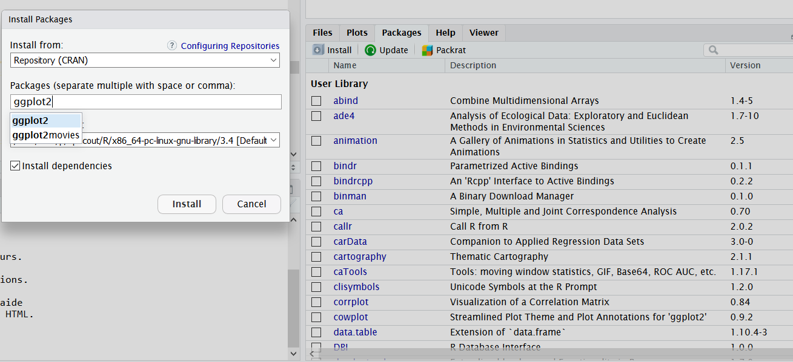
</p>


 
<br/>


## Aide et documentation

Il y a plusieurs façons d'obtenir de l'aide avec R studio. **Vous pouvez utiliser l'onglet d'aide proposé par Rstudio** et accéder à la documentation d'une fonction :

<p class="center">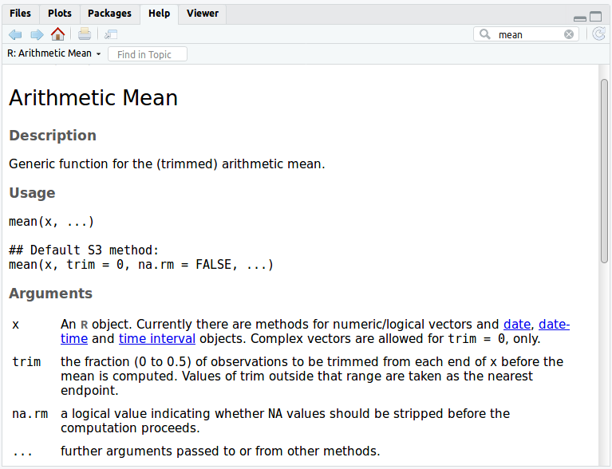
</p>

Il est possible d'**obtenir de la documentation en utilisant des fonctions**, Ex :

```{r warning=FALSE, message=FALSE, eval=TRUE, include=FALSE}
library(cartography)  
```

```{r warning=FALSE, message=FALSE,eval=FALSE}

# Documentation des packages
help("cartography") 

# Accèder à la documentation d'une fonction
?choroLayer

# Accèder à une vignette (falcutatif) de package
vignette(topic = "cartography", package = "cartography")

# Accèder à une cheatsheet (falcutatif) de package
vignette(topic = "cheatsheet", package = "cartography") 

# Chercher documentation par mot clé
help.search("Map")

```

Exemple de la *cheatsheet* (antisèche) du <span style="color:#4B0082">package</span> "cartography" :

<p class="center">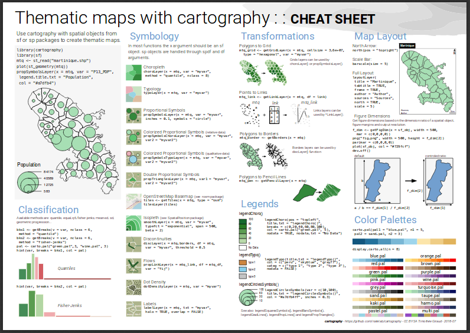
</p>

<br/>

**Ne négligez pas le service d'autocomplétion proposé par RStudio**. C'est un véritable assistant de programmation. Il permet par exemple de s'assurer du bon orthographe d'un objet ou d'une fonction ou de connaître les différents arguments possibles d'une fonction. Pour cela **il suffit d'utiliser la touche `tab` lors de la saisie**. RStudio vous proposera alors les possibilités qui s'offrent à vous.

<p class="center">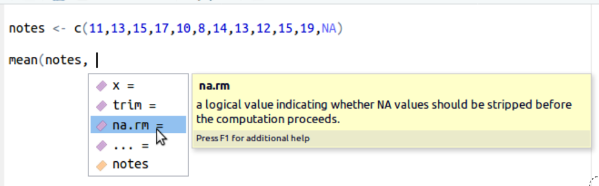
</p>

Enfin, **internet est une ressource documentaire trés riche pour R**. Vous y trouverez toujours une réponse à vos questions, et presque toujours en français !

<br/>

## Règles de codage

Les [**règles de codage**](https://fr.wikipedia.org/wiki/R%C3%A8gles_de_codage) permettent d'écrire un code plus clair et plus lisible pour soi et pour les autres. 
Vous pourrez trouver plusieurs propositions de *coding style* car il n'existe pas de style officiel pour le logiciel R. Quelque soit le style choisi l'idée est de conserver le même tout au long d'un programme.   
Voir par exemple :   

- [Advanced R - Style guide](http://adv-r.had.co.nz/Style.html)   
- [Google's R Style Guide](https://google.github.io/styleguide/Rguide.xml)   
- [R Style Guide](http://jef.works/R-style-guide/)  


**Troix règles font tout de même l'unanimité :** 

- Eviter les lignes de plus de 80 charactères.    
- Utiliser un espace avant et après les opérateurs :
```{r warning=FALSE, message=FALSE, eval=FALSE}

# Préférez
x  <-  12
# à
x<-12

# Préférez
average  <-  mean(feet  /  12 + inches,  na.rm = TRUE)
# à
average<-mean(feet/12+inches,na.rm=TRUE)

```

- Eviter les lignes avec plus d'une opération :
```{r warning=FALSE, message=FALSE, eval=FALSE}

### Il est possible d'écrire plusieurs opération sur une me ligne, en les séparant d'un ;
# Exemple
notes <- c(4,2,8,6,5,9,3,2,5,6); mean(notes); sd(notes)

# Mais cela est à proscrire.
# Pour plus de visibilité, préférez :
notes <- c(4,2,8,6,5,9,3,2,5,6)
mean(notes)
sd(notes)

```

<br/>

**L'intégration de commentaire dans le code est également une pratique appréciée**. Pour cela, **insérer un # en début de ligne**.

```{r warning=FALSE, message=FALSE, eval=FALSE}

# Les caractères suivants seront considérés comme du commentaire
# Vous pouvez écrire ce que vous voulez, mais toujours précédé d'un #


# une chaîne de 5# (#####) permet de créer de bloc de code dépliable :

###### 
mean(c(1,7,3,2,8,9,2,3))

```


<br/>

## Manipulations basiques

### Sauvegarder et supprimer des objets

Il est possible de supprimer tous les objets crées en cliquant sur l'icône `r knitr::include_graphics('figures/clear.png')` dans la fenêtre de l'espace de travail. 
Plusieurs fonction permettent également de gérer les objets. En voici quelques-unes :

```{r warning=FALSE, message=FALSE,eval=FALSE}

# lister tous les objets crées
ls()    

# Supprimer un objet, ex : rm(mon_objet)
rm()    

# Supprimer tous les objets
rm(list=ls()) 

# Sauvegarder un objet dans un fichier (format rds)
saveRDS() 

# Lire un fichier rds pour charger l'objet stocké
readRDS() 

```

Exemple pratique :

```{r warning=FALSE, message=FALSE,eval=FALSE}

mon_objet <- c("un", "deux", "trois")

# Sauvegarde d'un objet dans un fichier
saveRDS(mon_objet, file="Nom_du_fichier")

# Suppression de l'objet TEMPORAIRE
rm(mon_objet) 

# Lecture du fichier et assignation dans un objet
mon_objet_new <- readRDS("Nom_du_fichier") 

```

<br/>


### Import/export de données

Il est possible d'importer et d'exporter des données sous différents format. Pour cela, une série de <span style="color:#8C001A">fonctions</span> (primitives ou non) peut être utilisées.
Quelques exemples :

```{r warning=FALSE, message=FALSE,eval=FALSE}

### IMPORTER
read.table() # Importer une table (format multiple)
read.csv()   # Fichier csv
read.xlsx()  # Fichier Excel -> library(xlsx) 
read_sas()   # Fichier sas -> library(haven)
read.dbf()   # Fichier dbf -> library(foreign)
read_sf()    # Fchier shape <- library(sf)

```

Pour que l'import soit correct, il est souvent nécessaire de renseigner un certain nombre d'arguments, comme par exemple :

**header** = valeur logique qui indique si la première ligne du fichier importé contient les noms des variables.<br/>
**sep** = Indique le séparateur de champ du fichier.<br/>
**stringsAsFactor** = Le données de type caractère sont transformées (par défaut) en facteur.<br/>
**Encoding** = Indique l'encodage utilisé pour les chaînes de caractères.<br/>

```{r warning=FALSE, message=FALSE,eval=FALSE}

# Import d'un fichier 
# not run
Mon_Objet <- read.table("/data/user/documents/mes.donnes.csv"), header=TRUE, sep=",", 
stringsAsFactors=FALSE, encoding="UTF-8")

```


<br/>

```{r warning=FALSE, message=FALSE,eval=FALSE}

### EXPORTER

## Table de données
write.table(Mon_Objet, "c:/mydata.txt", sep="\t") 

# fomrat csv
write.csv(Mon_Objet, file = "MyData.csv")

# format Excel -> library(xlsx)
write.xlsx(Mon_Objet, "c:/mydata.xlsx")

# format sas, spss... -> library(foreign)
write.foreign(Mon_Objet, "c:/mydata.txt", "c:/mydata.sas",   package="SAS")
write.foreign(Mon_Objet, "c:/mydata.txt", "c:/mydata.sps",   package="SPSS")

# format shape
st_write()

## Figures plot() 
# format jpeg
jpeg()
# format png
png()
# format pdf
pdf()

# Exemple d'enregistrement d'une figure :
jpeg('rplot.jpg')
plot(runif(10, 1, 100),runif(10, 1, 100))
dev.off()

```

Il est possible de télécharger un fichier mis à disposition en ligne, avec la fonction :

```{r warning=FALSE, message=FALSE,eval=FALSE}

# Télécharger un fichier
download.file()

```


<br/>

### Interroger un objet

Pour les exemples ci-dessous, l'objet dataframe *mtcars* est utilisé. Il s'agit d'un exemple de data frame, directement implanté dans R.

```{r warning=FALSE, message=FALSE, eval=FALSE}

# Pour visualiser le data frame
View(mtcars)

```

```{r warning=FALSE, message=FALSE}

# Aperçu rapide dans la console
str(mtcars)
# Premiers éléments (6 par défaut) de l'objet
head(mtcars)
# Derniers éléments (6 par défaut) de l'objet
tail(mtcars)
# Statistiques basiques
summary(mtcars)
# classe/type des éléments/objets
class(mtcars)
# Longueur = nombre d'éléments de l'objet
length(mtcars)

# Pour les objets à plusieurs dimensions :
# Nom des colonnes / objets
colnames(mtcars)
names(mtcars)
# Nom des lignes
row.names(mtcars)
# Dimension de l'objet
dim(mtcars)
# Nombre de colonnes
ncol(mtcars)
# Nombre de lignes
nrow(mtcars)

```

<br/>


### Séléction par attributs

Comme pour toute les opérations dans R, il existe plusieurs solutions :

```{r warning=FALSE, message=FALSE}

# Methode 1 
# df[ligne, colonne]
mtcars[mtcars$cyl==4 & mtcars$wt > 3,  c(1:7) ]

# Methode 2, fonction subset
subset(mtcars, cyl==4 & mtcars$wt > 3, select=c(1:7))

# Methode 3, fonction filter() du package 'dplyr'
library(dplyr)
mtcars %>% 
  select(1:6) %>%
  filter(cyl==4, wt > 3)


```

<br/>

### Joindre

```{r warning=FALSE, message=FALSE}

# Construction de deux dataframe avec un identifiant commun
ID <- as.character(c(1, 2, 3, 4))
Prenom <- c('John','Peter','Jolie','John')
Nom <- c('Doe','Gynn','Hope','snow')

# Dataframe 1
mon_tab_1 <- data.frame(ID, Prenom)

# Dataframe 2
mon_tab_2 <- data.frame(ID, Nom)

# Jointure des deux objets avec la fonction merge()
merge(mon_tab_1, mon_tab_2, by="ID")
```


### Combiner

```{r warning=FALSE, message=FALSE}

# par les colonnes
# les data frames doivent avoir le même nombre de lignes :
cbind(mon_tab_1,mon_tab_2)

# Par les lignes
# les data frames doivent avoir les mêmes colonnes (nom identiques) :
colnames(mon_tab_1) <- colnames(mon_tab_2)
rbind(mon_tab_1,mon_tab_2)

```


<br/>

### Regroupement

Ci-dessous, deux solutions de regroupement possibles, avec opération sur une variable :

```{r warning=FALSE, message=FALSE}

# METHODE 1 -> Fonction primitive aggregate(), fonction applicable sur une seule variable
# Regroupement des lignes en fonction des valeurs des variables disp et cyl
# + somme des valeurs de la variable vs
aggregate(data = mtcars, disp ~ cyl + vs, sum)

# METHODE 2 -> Utilisation du package dplyr
# + calcul d'une somme, d'une moyenne et d'un nombre de ligne pour des valeurs regroupées
library(dplyr)
mtcars %>% 
  group_by(cyl, vs) %>% 
  summarise(sum_disp=sum(disp), moy_hp=mean(hp), nb_element=length(cyl) )

```

<br/>

### Manipulation de data frame

```{r warning=FALSE, message=FALSE}

# Construction data frame
mydata <- data.frame(id=c(1,1,2,2),
                     time=c(1,2,1,2), 
                     x1=c(5,3,6,2), 
                     x2=c(6,5,1,4))

mydata


# TRANSPOSITION
t(mydata)

```

<br/>

Le package <span style="color:#4B0082">reshape2</span> contient plusieurs fonctions de remodelage de data frame :

```{r warning=FALSE, message=FALSE}
library(reshape2)

# Fonction melt() 
mydata_melt <-melt(mydata, id=c("id","time"))
mydata_melt

#  fonction dcast(data, formula, function) - s'applique sur des 'melted data'
mydata_melt_cast <- dcast(mydata_melt, id~variable, mean)
mydata_melt_cast 


```


Il est aussi possible d'utiliser des fonctions du package <span style="color:#4B0082">tidyr</span>, developpé par Rstudio. 

<br/>  

### Trier des données

```{r warning=FALSE, message=FALSE}

# Fonction sort()
my_vector <- c(7,9,4,5,2,3,6,1)
sort(my_vector)

# Fonction order()
order_mtcars <- mtcars[order(mtcars$cyl, -mtcars$disp, mtcars$carb, decreasing = TRUE), ]
head(order_mtcars)

```

<br/>

### Boucle itérative 

**Une boucle est une série d'instructions exécutées jusqu'à ce qu'un résultat particulier soit obtenu ou qu'une condition pré-déterminée soit remplie**. Les boucles permettent de ré-utiliser des séries d'instructions et permettent ainsi de limiter le nombre d'instructions.

```{r warning=FALSE, message=FALSE, eval=FALSE}

# Structure d'une boucle
for (variable in vecteur) {
  instruction
}

```

```{r warning=FALSE, message=FALSE}

# Exemple
for (i in 1:5) {
  print(paste0("Passage n°", i))
}

```

<br/>

### Fonctions apply

L'utilisation d'une boucle est très fréquente en traitement de données. Une boucle peut permettre d'effectuer des traitements sur des objets de structure multidimensionnelle (data frame, matrice, array, sf...). Mais pour cela, la boucle for n'est pas la technique otpimum. Les concepteurs de R ont développé des fonctions spécialement prévu à cet effet. 

```{r warning=FALSE, message=FALSE}

# Appliquer une fonction sur les lignes :
apply(mtcars,1,mean)

# Appliquer une fonction sur les colonnes :
apply(mtcars,2,sum)

# Appliquer une fonction sur chaque items (sortie vector) :
sapply(mtcars$mpg, function(x) x/100)

# Appliquer une fonction sur chaque items (sortie list)
Resultat_lapply <- lapply(mtcars$mpg, function(x) x/100)
Resultat_lapply[1:5]

```
<br/>

### Test conditionnel

Un test conditionnel permet d'exécuter une portion de code ou non en fonction du résultat de variables booléennes.

```{r warning=FALSE, message=FALSE, eval=FALSE}

# Test simple
if (condition){action}

# Test avec deux solutions
if (condition){
  action1
} else {
  action2
}

```

```{r warning=FALSE, message=FALSE}
# Exemple
x <- "chaîneDeCaractères"
x <- TRUE
x <- 12

if (is.character(x)){
  
  print("x est une chaîne de caractères")
  
} else {
  
  if (is.numeric(x)) {
    
    print("x est numéric") 
    
  } else {
    
    print("x est bizarre !")
    
  }
}

```

<br/>

### Gestion de chaîne de caractères

Il existe de nombreuses fonctions primitives pour gérer les chaînes de caractère. Quelques exemples : 

```{r warning=FALSE, message=FALSE}

# Concaténation de chaîne de caractère, AVEC séparateur
paste("Champions", "du", "monde", sep=" ")

# Concaténation de chaîne de caractère, SANS séparateur
paste0("Champions", "du", "monde")

```

```{r warning=FALSE, message=FALSE, eval=FALSE}

# Gérer la casse
text <- "champion Du MONDEEEEEE !"

# tout en minuscule
tolower(text)

# tout en majuscule
toupper(text)

```
```{r warning=FALSE, message=FALSE, eval=FALSE}

# Nombre de caractères
nchar(text)

```

```{r warning=FALSE, message=FALSE, eval=FALSE}

# Scinder une chaîne en fonction d'un caractère
strsplit(text, split = " ", fixed = TRUE)

# Remplacer un (ou plusieurs) caractère(s) par un autre
gsub("ion", "ionne", text)

```

Si vous souhaitez réaliser des traitements complexes sur des chaînes de caractère, vous pouvez utilisez la librairie de référence <span style="color:#8C001A">stringr</span> vous permettra de réaliser toutes les opérations les plus complexes. Quelques exemples :

```{r warning=FALSE, message=FALSE, eval=FALSE}

# Librairie de référence pour le gestion de chaîne de caractère
library(stringr)

# Détécter la présence d'un caractère ou d'une chaîne 
str_detect(text,  "E")

# Position de la première occurrence d'un caractère ou d'une chaîne 
str_locate(text, "pi")

# Toutes les positions d'un caractère ou d'une chaîne 
str_locate_all(text, "E")

# Extraire un segment de chaîne de caractère
str_sub(text,  5, 9)

# Suppression des espaces en début et fin de chaîne de caractère
str_trim("  abc   ")

```


Il est possible de combiner l'**utilisation des expressions régulières avec toutes ces fonctions**. 

**Les expressions régulières**, ou plus communément regex (contraction de regular expression) **permettent de représenter des modèles de chaînes de caractère. Ce sont des outils très puissants et très utilisés : on peut les retrouver dans de nombreux langages comme le PHP, MySQL, Javascript...** Si cet outil est très puissant, il est relativement difficile à appréhender au début car les expressions régulières peuvent prendre des formes complexe à interpreter. Ex :

```{r warning=FALSE, message=FALSE}

# EXEMPLE d'utilisation d'expression régulière (regex)

# Création d'une vecteur d'adresse mail
# Avec des adresses mail, parfois mal orthographiées
emails_list <- c("hugues.pecout@cnrs.fr", 
                 "hugues@gmail", 
                 "blabla.com", 
                 "hugues.pecout@gis-cist.fr",
                 "timothée.giraud@cnrs.fr")


# Expression regex qui répond aux adresses email
regex <- "\\<[A-Z0-9._%+-]+@[A-Z0-9.-]+\\.[A-Z]{2,}\\>"


# Détection des emails corrects présentes dans ma liste d'email
grep(regex, emails_list, ignore.case=TRUE)


```

<br/>

### Répresentations graphiques

Réaliser des graphiques en utilisant des <span style="color:#8C001A">fonctions</span> primitives :

```{r warning=FALSE, message=FALSE, eval=FALSE}

plot()
hist()
barplot()
boxplot()
pie()
lines()
abline()
legend()

```

```{r warning=FALSE, message=FALSE}

# Exemple
hist(mtcars$mpg, 
     breaks=12, 
     col="red",
     xlab= "mpg",
     ylab = "Fréquence",
     main = "Distribution de la série statistique 'mpg'")

```


Toute **une série d'arguments permet d'ajuster les représentations**, ex :      
**axes** : Afficher ou non les axes (TRUE ou FALSE)            
**log** : Mettre les axes à l'echelle logarithmique ("x", "y", "xy")            
**type** : Argument qui contrôle le type d'axe produit ("p"= points, "l" = ligne, "o" = point relier par ligne...)       
...    

**Plusieurs éléments peuvent être superposés** aux graphiques (en utilisant l'argument **add =TRUE**), ex :       
**text()** : Ajouter du texte           
**legend()** : Ajouter un légende        
**abline()** : Ajouter une ligne     
**axis()** : Ajouter un axe    
...  


**Il est possible d'afficher plusieurs graphiques en même temps**, à l'aide des fonctions **par()** ou **layout()**. Ex : 

```{r warning=FALSE, message=FALSE}

# Division de la fenêtre graphique en 2 lignes et 2 colonnes
par(mfrow=c(2,2))

# Création de 4 différents graphiques
plot(mtcars$wt, mtcars$mpg, main="Graph 1")
plot(mtcars$wt, mtcars$disp, main="Graph 2")
hist(mtcars$wt, main="Graph 3")
boxplot(mtcars$wt, main="Graph 4")

```


**Pour réaliser des graphiques plus spécifiques** (et plus beau !), **utilisez la librarie de référence** <span style="color:#8C001A">**ggplot2**</span>. Ex :

```{r warning=FALSE, message=FALSE}

library(ggplot2)

# Exemple : Density plots
g <- ggplot(mpg, aes(cty))
g + geom_density(aes(fill=factor(cyl)), alpha=0.8) + 
  labs(title="Density plot", 
       subtitle="City Mileage Grouped by Number of cylinders",
       caption="Source: data R mtcars",
       x="City Mileage",
       fill="# Cylinders")

```

<br/>

## > Exercice

<div  class="Exercice">


1) Créez un nouveau projet à l'emplacement de votre choix.    
<br/>

2) Récupérez les données. 

Téléchargez <a href="https://gitlab.huma-num.fr/hpecout/init_stat_descript_r/-/raw/master/data.zip?inline=false" onclick="window.open(this.href); return false;">ces données</a> et décompressez l'archive dans le repertoire de votre projet. Il s'agit de données sur la structure de la population des communes de la Martinique en 2011 et 2016 et d'une couche géographique associée.     
<p class="source"> Source : INSEE - Recensement de population & IGN, BD ADMIN EXPRESS</p> 
<br/>

3) Chargez le fichier *INSEE_COM_972.csv* dans un objet.

```{r warning=FALSE, message=FALSE, eval=FALSE}

# Fonctions possibles
read.csv()
read.table()

# Quelques arguments utiles...
header=TRUE
sep=";"
stringsAsFactors=FALSE

```
<br/>

4) Visualisez et interrogez votre objet data frame, en ligne de code ET depuis l'interface RStudio.

```{r warning=FALSE, message=FALSE, eval=FALSE}

# Fonctions possibles :
View()
head()
dim()
str()
summary()
class()
colnames()


# Depuis l'interface : onglet 'Environnement' (en haut à droite)
# Puis cliquer sur l'objet souhaité

```
<br/>

5) Corrigez la classe de données de certaines variables

```{r warning=FALSE, message=FALSE, eval=FALSE}

# Convertissez 'CODGEO, 'DEP', 'REG', 'CATAEU2010' en caractère
# Convertissez les variables stockées en facteur en caractére
as.character()

```
<br/>

6) Séléctionnez les communes isolées hors influence des pôles (CATAEU2010 == 400) de plus de 2000 habitants en 2016 (P16_POP).

```{r warning=FALSE, message=FALSE, eval=FALSE}

# Un début de solution possible :
tableau[tableau$CATAEU2010==400 & ... , ]

```
<br/>


7) Créez une nouvelle variable contenant la part de la population agée de 0 à 14 ans en 2016 (P16_POP0014 / P16_POP * 100)

```{r warning=FALSE, message=FALSE, eval=FALSE}

# Assigner les valeur dans une nouvelle colonne
tableau$Ma_variable <- ... ?

```
<br/>

8) Chargez la couche géographique *martinique.shp* dans un objet.

```{r warning=FALSE, message=FALSE, eval=FALSE}

# Utilisez une fonction de la library sf
st_read()


```
<br/>

9) Réalisez une jointure entre la couche géographique et votre tableau de données

```{r warning=FALSE, message=FALSE, eval=FALSE}

# Pour réaliser une jointure
merge()

```

Puis, **appliquez la fonction plot()** au résultat...


</div>

<br/>


### Bonus

<div  class="Exercice">


1) Installez le package <span style="color:#4B0082">Rcade</span> développé par Romain Lesur.

Ce <span style="color:#4B0082">package</span> se trouve-t-il sur le CRAN ? 
Où se trouve-t-il et pourquoi ?

2) Installez le package

Essayer-le... pas plus de 2-3 minutes :-) )

3) Supprimez le package  


</div>

<br/>

# Statistique univariée

<br/>

## Vocabulaire


<div class="div_voc">


<p class="titre_def">Statistique descriptive</p>

<div class="div_def"><p class="def">Tout nombre, calculé à propos d’une population et qui contribue à décrire un aspect de cette population, est une statistique. Fréquences, médianes, quartiles, déciles, moyennes, variances, etc. sont des statistiques.  
La statistique descriptive regroupe l'ensemble des techniques pour décrire numériquement une distribution.</p></div>

<br/>

<p class="titre_def">Population (p) et Individu (i)</p>
<div class="div_def"><p class="def">Une population est un ensemble d'individus (ou unités statistiques) sur lesquels porte l'étude statistique.</p>
</div>

<br/>

<p class="titre_def">Effectif (N ou n)</p>

<div class="div_def"><p class="def">Nombre d’individus d’une population(N) ou d’une partie quelconque de cette population(n).<br/>    


$$N=\sum_{} i$$

</p></div>

<br/>

<p class="titre_def">Variable (x) ou caractère </p>

<div class="div_def"><p class="def">Une variable est une information dont on recueille (ou observe ou mesure) la valeur sur chaque individu. On parle de variable parce que la valeur de l’information n’est pas la même d’un individu à l’autre. Une variable est quantitative (valeur numérique) ou qualitative :   

**Une variable est quantitative si elle est mesurable**. Ex : Un temps.

Elle est **discrète** si elle ne prend que des valeurs isolées. Ex : un âge.<br/>
Elle est **continue** si elle peut prendre toutes les valeurs comprises entre 2 nombres. Ex : une distance.


**Si une variable n'est pas mesurable, elle est dite qualitative**. Ex: Une couleur.

Elle est **ordinale** si on peut comparer/trier les modalités entre elles. Ex : Une appréciation. <br/>
Elle est **binaire** si elle n'est composé que de deux modalités. Ex : oui/non. <br/>
Elle est dite **nominale** dans les autres cas. Ex : Une forme. 


Il faut bien distinguer la nature de la variable de son format de stockage (classe de donnée), numérique ou alphanumérique. Une variable qualitative peut aussi bien être codée avec des caractères alphanumériques qu’avec des caractères numériques (Ex : "Homme" ou 0 / "Femme" ou 1). Une variable quantitative peut être codée avec des caractères numériques aussi bien qu’avec des caractères alphanumériques : (Ex : "dix sept" ou 17 ).
</p>

<p class="center">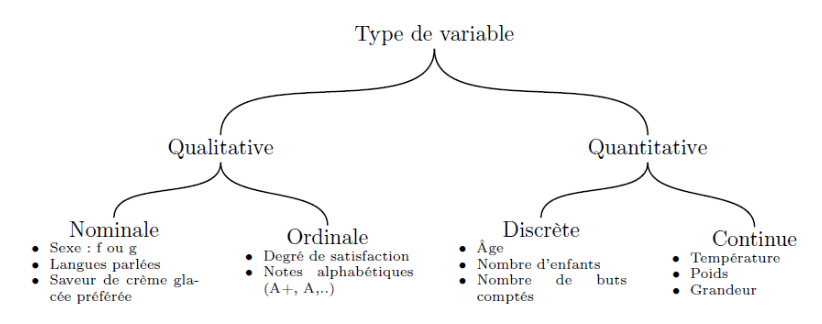
</p>

</div>

<br/>


<p class="titre_def">Distribution</p>

<div class="div_def"><p class="def">La distribution des individus selon une (ou deux) variables, est la répartition de l'effectif(n) des individus(i) par valeur ou classe de valeur. 

</p>

</div>

<br/>

</div>


<br/>

<p class="center">  Figure : Les différents éléments d'une population </p>

<p class="center">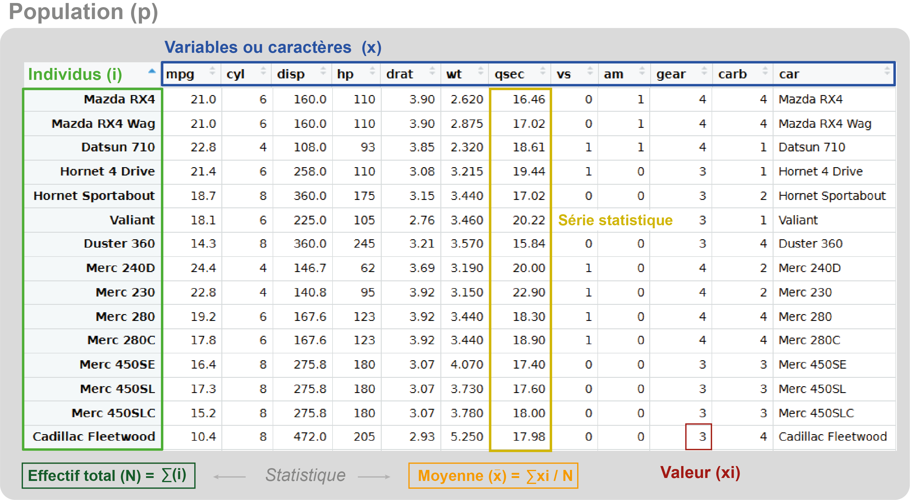
</p>

<br/>

<div class="div_voc">


<p class="titre_def">Fréquence (f) ou proportion</p>

<div class="div_def"><p class="def">Rapport entre un effectif(n) particulier d’individus et l'effectif total(N).<br/>

$$f(n)=\frac{n}{N}$$


</p></div>

<br/>


<p class="titre_def">Moyenne</p>

<div class="div_def"><p class="def">Valeur uniforme que devrait présenter chaque individu d’un ensemble (population ou échantillon) pour que le total de l’ensemble soit inchangé.<br/>   


$$\bar{x}=\frac{\sum{xi}}{N}$$

</p></div>

<br/>


<p class="titre_def">Mode</p>

<div class="div_def"><p class="def">le mode (ou valeur dominante) est la valeur la plus représentée d'une variable quelconque dans une population donnée. Une répartition peut être unimodale ou plurimodale (bimodale, trimodale…) si deux ou plusieurs valeurs de la variable considérée émergent également. Une distribution sans aucun mode est appelée distribution uniforme. </p></div>

<br/>


<p class="titre_def">Médiane, quartiles, déciles et centiles</p>

<div class="div_def"><p class="def">
Ces valeurs correspondent respectivement à une proportion de l'effectif des individus rangés par valeurs croissantes.<br/>
Médiane : valeur qui divise la série statistique en deux (50 %)<br/>
Quartiles : valeurs qui divisent la série statistique en quatre (Q1=25%, Q2=50%, Q3=75%)<br/>
Décile : valeurs qui divisent la série statistique en dix (10% à 90%)<br/>
Centiles : valeurs qui divisent la série statistique en cent (1% à 99%)<br/>

</p></div>

<br/>


<p class="titre_def">Intervalle interquartile</p>

<div class="div_def"><p class="def">Basé sur les quantiles, l’intervalle interquartile (Q3-Q1) est un paramètre de dispersion absolue qui correspond à l’étendue d'une distribution une fois que l’on a retiré les 25% des valeurs les plus faibles et les 25% des valeurs les plus fortes.</p></div>

<br/>


<p class="titre_def">Ecart absolu moyen</p>

<div class="div_def"><p class="def">Moyenne de la valeur absolue des écarts à la moyenne. Autrement dit, c’est la distance moyenne à la moyenne.</p></div>

<br/>


<p class="titre_def">Ecart absolu médian</p>

<div class="div_def"><p class="def">Moyenne des écarts à la médiane.</p></div>

<br/>


<p class="titre_def">Variance(σ2) et écart-type(σ)</p>

<div class="div_def"><p class="def">Indicateurs de la dispersion des valeurs des individus autour de la moyenne. La variance est la moyenne des carrés des écarts à la moyenne. L’écart-type est sa racine carrée. Ce sont des paramètres de dispersion.<br/>   

$$\sigma^x = \sqrt{ \frac{\sum_{i=1}^{n}(x_i - \mu)^2} {n}} $$

</p></div>

<br/>
<p class="titre_def">Coefficient de variation</p>
<div class="div_def"><p class="def">Le coefficient de variation (CV) est le rapport de l'écart-type à la moyenne. Le coefficient de variation, également nommé écart type relatif, est une mesure de dispersion relative. Plus la valeur du coefficient de variation est élevée, plus la dispersion autour de la moyenne est grande. Il est généralement exprimé en pourcentage. Sans unité, il permet la comparaison de distributions de valeurs dont les échelles de mesure ne sont pas comparables.

$$CV = \frac{\sigma }{\mu } $$

</p>


</div>


<br/>

<p class="titre_def">Amplitude</p>

<div class="div_def"><p class="def">Longueur de l'intervalle entre la valeur minimum et maximum.</p></div>

<br/>


<p class="titre_def">Discrétiser une distribution</p>

<div class="div_def"><p class="def">

**Discretiser revient à rendre discret des valeurs continues**. Cela consiste à classer les valeurs quantitatives d'une série statistique par intervalle de valeur selon des critères justifiables **afin d'en améliorer la lecture**. 

L'ensemble des classes (intervalles de valeurs) créé forme ainsi une partition de toutes les valeurs possibles de la variable.

Exemple :  
Il est par exemple possible de discrétiser les valeurs d'un variable s'échalonnant de 1 à 25, en construisant les classes suivantes :   [min à 5] - [6 à 10] - [11 à 15] - [16 à 20] - [21 à max] </p></div>


<br/>

<p class="titre_def">Normaliser une distribution</p>

<div class="div_def"><p class="def">
**La normalisation d'une (ou plusieurs) série(s) de données est nécessaire quand l'incompatibilité des unités de mesures entre les variables peut affecter les résultats** sans apporter d'interprétations claires.
Elle permet d'ajuster une série (vecteur) de valeurs suivant une fonction de transformation **pour les rendre comparables** avec quelques points de référence spécifiques.

Deux exemple de normalisation :

- Transformation en pourcentage (en ligne, en colonne ou les deux):


<p class="center">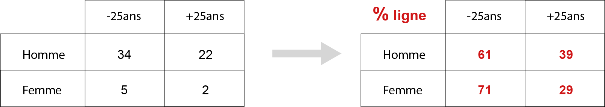
</p>

<br/>

- Standardisation (centrer-réduire):

Il s'agit d'un centrage par rapport à la moyenne puis d'une réduction par rapport à l'écart-type :

$$Y_{i} =\frac{X_{i} - \bar{x}}{\sigma^x }$$

<p class="center">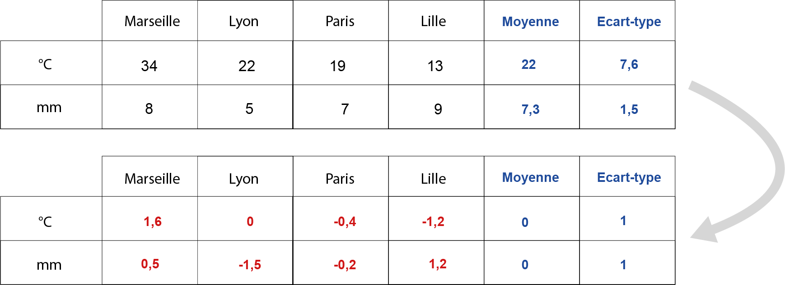
</p>


</p></div>


</div>
   
<br/>


## Résumer une variable

Avant de résumer une ou plusieurs variables statistiques, **il est important d'explorer et de visualiser les données. Cela permet de détécter les caractèristiques des données étudiées, et de les traiter correctement**.

Comment se structure la table de données ? Est-elle correctement construite et renseignée ?   
Comment sont nommées les individus et les variables ?   
Quelle est la classe de données des différentes variables (numérique, chaîne de caractère, booléenne...) ?  
Quelles sont les types des variables stockées (quantitative, qualitative...) ?      

```{r warning=FALSE, message=FALSE,eval=FALSE}

# Vous pouvez utiliser le jeu de donnée exemple "hdv2003" du package questionr
library(questionr)
data(hdv2003)

# 1) Utilisation de l'interface RStudio

# 2) ET Fonctions possibles (cf. 1.5 'Interroger un obet')
View()
str()
colnames()
names()
row.names()
dim()
class()
is.na()
colSums(is.na())

```

<br/>

### La distribution

Lorsque l'on étudie une variable, Il est important de s'intérresser à **la distribution de sa série statistique**.
Pour cela, il est necessaire de calculer la **table de fréquence**, qui s'effectue différement selon le type de variable :

#### Variable qualitative : fréquence des individus par modalités.

```{r warning=FALSE, message=FALSE}

# Jeu de données exemple :
library(questionr)
data(hdv2003)

# Effectifs par modalité -> table()
table(hdv2003$occup)

# Effectifs relatifs -> prop.table()
prop.table(table(hdv2003$occup))

# Réprésenter sur un diagramme circulaire ->  pie ()
# Réprésenter sur un diagramme -> barplot()
library("RColorBrewer")
barplot(table(hdv2003$occup), col=brewer.pal(n = 9,  "Paired"), las=2 ,cex.names=0.6)

```

Pour une **variable qualitative ordinale**, il est également possible de **calculer la fréquence cumulée** (cf. ci dessous).

<br/>

#### Variable quantitative: fréquence des individus par classe.

Pour faciliter l'interpretation de la fréquence d'une variable quantitative, il est souvent nécessaire de discrétiser la série statistique en plusieurs classes d'amplitude égale, car (en général) aucune valeur n'est identique.

Il est trés simple de réaliser l'histogramme d'une distribution discrétisée en plusieurs classes d'amplitude égale avec la **fonction <span style="color:#4B0082">hist()</span>**.


```{r warning=FALSE, message=FALSE}

# Vous pouvez utiliser le jeu de donnée exemple "mtcars"
data(mtcars)

# Pour représenter la distribution d'une série statistique sans la discrétiser préalablement -> hist()
hist(mtcars$mpg, breaks=12, probability = TRUE)

```


<br/>

### Les valeurs centrales

Pour les variables quantitatives, des résumés numériques (valeurs centrales, paramètres de dispersion absolue et relative) peuvent être calculés.**Le mode** peut être également calculé pour les variables **qualitatives ordinales et nominales**, et **la médianne** peut être calculé pour les variables **qualitatives ordinales**.

<br/>


```{r warning=FALSE, message=FALSE}

# Moyenne -> mean()
mean(mtcars$hp)

# Médiane -> median()
median(mtcars$hp)

# Mode = Valeurs qui a la fréquence la plus élévée
result <-  as.data.frame(table(mtcars$hp))

# Trier les valeurs par leur fréquence -> order()
result[order(result$Freq, decreasing = TRUE),]

```

<br/>

### Les paramètres de dispersions absolue

Les **paramètres de dispersion absolue** se calculent uniquement sur les **variables quantitatives**.


```{r warning=FALSE, message=FALSE}

# Minimum
min(mtcars$hp)
# Maximum 
max(mtcars$hp)
# Etendue/Amplitude
max(mtcars$hp) - min(mtcars$hp)
# Quartiles
quantile(mtcars$hp)
# Quartiles + moyenne
summary(mtcars$hp)
# Intervalle inter-quartile (Q3 - Q1)
summary(mtcars$hp)[5] - summary(mtcars$hp)[2]
# Variance
var(mtcars$hp)
# Ecart-type 
sd(mtcars$hp) 
# Coefficient de variation (en %) - Ecart-type/moyenne * 100
sd(mtcars$hp) / mean(mtcars$hp) *100
```

<br/>


## Discrétiser une variable

**Pour réaliser une discétisation correcte, il est necéssaire de définir la forme de la distribution à discrétiser**.    
Ci-dessous, quelques formes classiques de distribution statistique :

<br/>

<p class="center">

</p>

<br/>

**En fonction du profil d'une distribution**, on utilise **différentes méthodes de discrétisation :**

<p class="methode">Amplitude égale</p> 
Toutes **les classes ont la même amplitude**.<br/>
<p style="color:grey;font-size:90%;">A privilégier pour les **distributions uniformes ou symétriques**. </p> 
<p class="methode">Discrétisation standardisée</p>
Les classes sont déterminées selon une **fraction d’écart-type par rapport à la moyenne**.
<p style="color:grey;font-size:90%;">A privilégier pour les **distributions symétriques**.</p> 
<p class="methode">Par seuil observé</p>
Les bornes sont **crées par observation de la distribution, de manière manuelle**.
<p style="color:grey;font-size:90%;">A privilégier pour les **distributions dissymétriques et/ou bimodales**.</p>  
<p class="methode">Effectifs égaux (quantiles)</p>
Les bornes sont construites en réalisant des **classes d’effectifs égaux**.
<p style="color:grey;font-size:90%;">A privilégier pour les **distributions dissymétriques et/ou bimodales**.</p>
<p class="methode">Q6</p>
**Variante de la discrétisation selon les quantiles** avec **isolement des classes extrêmes** de la série.
<p style="color:grey;font-size:90%;">A privilégier pour les **distributions dissymétriques et/ou bimodales**.</p>
<p class="methode">Fisher-Jenks</p>
Les classes construites **maximisent la variance inter-classe** et **minimisent la variance intra-classe**.
<p style="color:grey;font-size:90%;">A privilégier pour les **distributions dissymétriques et/ou bimodales**.</p>
<p class="methode">Progression géométrique</p>
Les classes sont **découpées selon une progression géométrique**.
<p style="color:grey;font-size:90%;">A privilégier pour les **distributions dissymétriques**.</p>
<p class="methode">Progression arithmétique</p>
Les classes sont établies **selon une progression arithmétique**.
<p style="color:grey;font-size:90%;">A privilégier pour les **distributions dissymétriques**.</p>

<br/>

**Le choix d'un méthode de discrétisation et du nombre de classes à un impact trés important sur l'interprétation de sa représentation visuelle. Cette <a href="http://mappemonde.mgm.fr/geovisu/119/" onclick="window.open(this.href); return false;">application</a>, proposée par Laurent Jégou (2017) en est une belle demonstration**.

<br/>

**Exemple pratique de discrétisation d'une variable** :

```{r warning=FALSE, message=FALSE, include=FALSE }

# Chargement des données
POP16_mtq <- read.csv("data/INSEE_COM_972.csv")

# Calcul d'un ratio, qui sera la variable quantitative continue à discrétiser
POP16_mtq$TX_0014 <- 100 * POP16_mtq$P16_POP0014/POP16_mtq$P16_POP

```

```{r warning=FALSE, message=FALSE, eval=FALSE }

# Chargement des données
POP16_mtq <- read.csv("data/INSEE_COM_972.csv")

# Calcul d'un ratio, qui sera la variable quantitative continue à discrétiser
POP16_mtq$TX_0014 <- 100 * POP16_mtq$P16_POP0014/POP16_mtq$P16_POP

```

<br/>

Pour discrétiser les valeurs de cette série statistique, utilisez la fonction <span style="color:#8C001A">getBreaks()</span> du package cartography :

```{r warning=FALSE, message=FALSE}

# Construction d'un vecteur avec les bornes de chaque classe - getBreaks() / library(cartography)
# method :
# Amplitude égale = "equal" 
# Discrétisation standardisée = "sd"
# Effectifs égaux = "quantile"
# Q6 = "q6"
# Fisher-Jenks = "fisher-jenks"
# Progression géométrique = "geom"
# Progression arithmétique = "arith"
# ?? = "em"
# ?? = "msd"

# my_discretisation <- c(1.00, 60.00, 190.00, 368.25, 697.50, 930.00, 1168.50, 1842.00, 8027.00)
# OU - 

library(cartography)
my_discretisation <- getBreaks(POP16_mtq$TX_0014 , nclass = NULL, method = "quantile", k = 1, middle = FALSE)
my_discretisation

# Afficher votre discrétisation sur l'histogramme de la distribution
hist(POP16_mtq$TX_0014, breaks=20, col="grey", main= "Distribution de la variable")
abline(v=mean(POP16_mtq$TX_0014), col="red", lwd=1 , lty=2,add=T)
abline(v=my_discretisation,col="blue", lwd=2, lty=2)
legend("topright", c("moyenne", "borne de classe"), fill=c(col="red", col="blue"), cex=0.8)

# Pour enregistrer l'appartenance de classe dans votre objet (sf ou data frame par ex) ->  cut()
POP16_mtq$CLASS_TX_0014 <- cut(POP16_mtq$TX_0014, my_discretisation,  include.lowest = TRUE, right = TRUE)

# Visualiser le nombre d'éléments par classe
table(POP16_mtq$CLASS_TX_0014)

```

<br/>


## Représentation graphique

<br/>

1) L'histogramme

```{r warning=FALSE, message=FALSE}

# Sous forme d'histogramme
hist(mtcars$qsec, breaks=10, col="grey", Freq=FALSE, main= "Distribution  variable quantitative continue 'qsec'")
abline(v=mean(mtcars$qsec), col="red4", lwd=2 , lty=1,add=T)
abline(v=quantile(mtcars$qsec),col="red", lwd=1, lty=2)
legend("topright", c("moyenne", "Quartiles"), fill=c(col="red4", col="red"), cex=0.8)
rug(mtcars$qsec, col="blue")

```

<br/>

2) La boite à moustaches (boxplot) :

<br/>

<p class="center">
{width=350px}
</p>


```{r warning=FALSE, message=FALSE}

# Boite à moustache
boxplot(mtcars$qsec,
        main = "Distribution variable quantitative continue 'qsec'",
        xlab = "qsec",
        col = "orange",
        border = "brown",
        horizontal = TRUE)

# ajouter la série statistique en bas du boxplot
rug(mtcars$qsec)


```

<br/>


3) La carte


**En fonction de la nature des variables à représenter, on ne doit pas utiliser les mêmes méthodes de représentation**. 
Cependant, pour réaliser toute sortes de cartes statistiques, vous pouvez n'utiliser qu'un seul package : '**<span style="color:#4B0082">cartography</span>**'

<br/>

<p class="center">

</p>
<p align="center"> Source : https://www.rdocumentation.org/packages/cartography/versions/2.1.1</p>

<br/>
```{r warning=FALSE, message=FALSE, include=FALSE}

# Chargement d'une couche géographique
library(sf)
mtq <- st_read("data/martinique.shp")

```

```{r warning=FALSE, message=FALSE, eval=FALSE}

# Chargement d'une couche géographique
library(sf)
mtq <- st_read("data/martinique.shp")

```

```{r warning=FALSE, message=FALSE}

# Jointure avec un tableau de données :
mtq <- merge(mtq, POP16_mtq, by.x="INSEE_COM", by.y="CODGEO")

# création d'une palette de couleur en N classe
cols <- carto.pal(pal1 = "wine.pal", n1 = 6)

# gestion des marges
opar <- par(mar = c(0,0,1.2,0))

# Affichage communnes de la Martinique
plot(st_geometry(mtq), col = "#5F799C", border = "white", 
     bg = "#A6CAE0", lwd = 0.5, add = FALSE)

library(cartography)
# Affichage cercles proportionnels + choroplète
propSymbolsChoroLayer(x = mtq, # sf object 
                      var = "P16_POP", # field used to plot the symbols sizes
                      var2 = "TX_0014", #  field used to plot the colors
                      col = cols, # symbols colors
                      inches = 0.3, # radius of the largest circle
                      method = "quantile", # discretization method (?getBreaks)
                      border = "grey50", # color of circle borders
                      lwd = 1, # width of the circle borders
                      legend.var.pos = "topright", # position of the first legend
                      legend.var2.pos = "left", # position of the second legend
                      legend.var2.title.txt =  
                        "Share of the\nyoung population\n(0 to 14 years old) (%)", 
                      legend.var.title.txt = "Total population",
                      legend.var.style = "c") # legend style

```


<br/>

## > Exercice


<div  class="Exercice">

1) Créez un projet (ou réutilisez le projet créé durant l'exercice 1).     
<br/>

2) Charger de nouveau le fichier *INSEE_COM_972.csv*, stocké dans le repertoire de votre projet.    
<br/>

3) Séléctionnez uniquement ces variables et créez un nouveau data frame.     

Code insee de la commune (**CODGEO**)    
Nom de la commune (**LIBGEO**)    
Libellé aire urbaine (**LIBAU2010**)    
Catégorie commune dans aire urbaine (**CATAEU2010**)    
Population total en 2016 (**P16_POP**)    
Nombre de personnes de 15 ans et plus en 2016 (**C16_POP15P**)    
Nombre d'agriculteurs et exploitants de 15 ans et plus (**C16_POP15P_CS1**)    
Nombre de retraités de 15 ans et plus (**C16_POP15P_CS7**)    

Les valeurs de ces variables sont-elles correctement stockées (Numerique ? caractère ? ...) 
<br/>

5) Créez une nouvelle variable avec la part de la population d'agriculteurs et exploitants dans la population active. Nommée cette nouvelle variable : TX_CS1_2016

Quel est le taux minimum ?  
Quel est le taux maximum ?  
Quel est l'amplitude de la variable ?   
Quelle est la moyenne ? 
Quelle indicateur divise la série statistique en deux ? Quelle est sa valeur ?   
Quel est son écart-type, son intervalle interquartile ?   

Comment résumer la distribution de cette variable par un graphique ? (plusieurs solutions sont possibles) 
<br/>

6) Discrétisez la variable TX_CS1_2016
```{r warning=FALSE, message=FALSE, eval=FALSE}

# Utilisez
getBreaks()

```
<br/>


7) Créez une variable qualitative à partir des valeurs de la variable TX_CS1_2016

```{r warning=FALSE, message=FALSE, eval=FALSE}

# Si TX_CS1_2016 < ..., alors CAT_CS1_2016 == "FAIBLE"
# Si TX_CS1_2016 < ...  & > ... , alors CAT_CS1_2016 == "MOYEN"
# Si TX_CS1_2016 > ... , alors CAT_CS1_2016 == "FORT"

# Utilisez la fonction 
cut() 

```
<br/>


8) Joingnez le tableau à la couche géographique de la Martinique. 

```{r warning=FALSE, message=FALSE, eval=FALSE}

# Importer le shape
st_read()

# Puis, jointure shape-tableau
merge()

```
<br/>


9) Cartographiez la part d'agriculteurs et exploitant dans la population active. 


```{r warning=FALSE, message=FALSE, eval=FALSE}

# Utilisez une fonction du package cartography :
?choroLayer()

```
<br/>

</div>

<br/>

# Statistique bivariée

<br/>


## Vocabulaire

<div class="div_voc">

<p class="titre_def">Statistique bivariée</p>

<div class="div_def"><p class="def">C'est l’étude des relations entre deux variables, quantitatives et/ou qualitatives. Les analyses bivariées consistent ainsi à étudier des variables prises en couple, via des techniques descriptives ou probabilistes. L’objectif est de **mettre en évidence un lien ou une absence de lien entre 2 variables, et d'étudier ce lien (sens, intensité)** lorsqu'il existe.</p>
<p class="def">L’analyse d’une relation bivariée avec deux types de variables possibles se résume à trois cas :</p>  
1- Relation entre **deux variables qualitatives** (3.2)      
2- Relation entre **une variable qualitative et une variable quantitative** (3.3)      
3- Relation entre **deux variables quantitatives** (3.4)  

</div>

<br/>

<p class="titre_def">Test statistique</p>
<div class="div_def"><p class="def">Un test statistique est une procédure de décision entre deux hypothèses. Il s'agit d'une démarche consistant à rejeter ou à ne pas rejeter une hypothèse statistique, appelée hypothèse nulle, en fonction d'un jeu de données (échantillon).</p>
</div>

<br/>

<p class="titre_def">Corrélation</p>
<div class="div_def"><p class="def">Mesure du lien d’association entre des phénomènes (variables) décrits par des séries statistiques. Le calcul d'une corrélation entre deux variables permet de savoir si elles sont liées.</p>
</div>

<br/>

<p class="titre_def">Tableau de contigence (tableau croisé)</p>
<div class="div_def"><p class="def">Pour déterminer s'il existe une relation entre deux variables étudiés, on construit un tableau de contingence.Les valeurs du tableau correspondent aux effectifs de population selon les modalités des deux variables. Ex :</p>

<p class="center">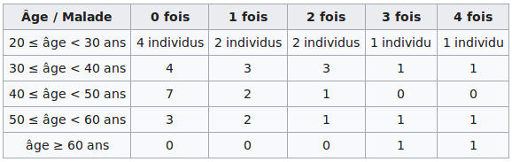
</p>

<p class="def">La construction d'un tableau de contingence est la première étape nécessaire pour évaluer la dépendance de deux variables qualitatives</p>
</div>


<br/>

<p class="titre_def">Résidu</p>
<div class="div_def"><p class="def">Les résidus d’une regression expriment l’écart entre les valeurs observées et les valeurs prédites par le modèle. Plus un individu aura des résidus fort (positifs ou négatif), moins sa position sera expliquée par le modèle. Il faudra alors trouver d’autres facteurs explicatifs.</p>
</div>

</div>

<br/>


## Deux variables qualitatives

**Un couple de variables qualitatives se décrit par ses fréquences conjointes dans un tableau *tris croisés* **.
Les fréquences obtenues peuvent être calculées par rapport à l’effectif total ou par rapport aux effectifs marginaux (effectif en ligne et colonne).
**Il s'agit de l’une des analyses les plus fréquentes lors du traitement d’enquêtes en sciences sociales**.


### Tableaux croisés

La manière la plus simple d’obtenir un tableau croisé est d’utiliser la fonction **<span style="color:#8C001A">table()</span>. 

```{r warning=FALSE, message=FALSE}

# Utilisation d'un jeu de donnéesdu package 'questionr'
head(hdv2003,3)

# tableau croisé avec table()
table(hdv2003$sport, hdv2003$qualif)

```

```{r warning=FALSE, message=FALSE, eval=FALSE}

# Croiser trois variables ou plus
table(hdv2003$sport, hdv2003$cuisine, hdv2003$sexe)

```

<br/>

Il est cependant difficile de comparer à partir des effectifs. **Le package **<span style="color:#4B0082">questionr()</span>** fournit des fonctions permettant de calculer facilement les pourcentages lignes, colonnes et totaux d’un tableau croisé**. Les pourcentages en lignes ou en colonne s’obtiennent avec les fonctions **<span style="color:#8C001A">lprop()</span>** et **<span style="color:#8C001A">cprop()</span>**. Celles-ci s’appliquent au tableau croisé généré par **<span style="color:#8C001A">table()</span>** :

```{r warning=FALSE, message=FALSE}

# Pourcentage en ligne d'un tableau croisé table(), avec lprop() du package 'questionnr'
lprop(table(hdv2003$sport, hdv2003$cuisine))

# Pourcentage en colonne d'un tableau croisé table(), avec cprop() du package 'questionnr'
cprop(table(hdv2003$sport, hdv2003$cuisine))

```

Les pourcentages totaux s’obtiennent avec la fonction **<span style="color:#8C001A">prop()</span>**

```{r warning=FALSE, message=FALSE}

# Pourcentages totaux d'un tableau croisé
prop(table(hdv2003$sport, hdv2003$cuisine), 
     digit=2, 
     percent=TRUE)


```

<br/>

### Le khi2 et la mesure des écarts à l’indépendance

A partir d’un tableau croisée, **on peut tester l’existence d’un lien entre les modalités de deux variables** avec le **test du Khi-2** : 


<div class="important2">

Cela consiste à **comparer la répartition observée à une répartition théorique  sous  hypothèse d’indépendance**, c’est-à-dire la répartition qu’on observerait s’il n’y avait aucun lien entre les deux variables. Cette répartition théorique consiste donc à redistribuer les effectifs conjoints tout en conservant les effectifs marginaux.   

**Le test du khi-2 permet d’établir à quel seuil de probabilité on peut rejeter l’hypothèse d’indépendance** entre des effectifs observés et des effectifs théoriques. **Plus le khi-2 est proche de zéro, plus le tableau des effectifs théoriques et celui des effectifs observées se confondent.**

**Un test de khi-2 s’applique uniquement sur des tableaux de contingence :**     
- ayant **au moins 2 lignes et 2 colonnes**     
- contenant des **valeurs positives entières**     
- ayant au **minimum 5 observations par cases** du tableau et/ou dans le tableau des effectifs théoriques.     

**Lorsque toutes les cases du tableau n’ont pas plus de 5 observations par cases, il est conseillé d’effectuer des regroupement de modalités** lorsque c’est possible.

</div>  

<br/>

L’objet créé par la fonction **<span style="color:#8C001A">chisq.test()</span>** est une liste qui contient tous les éléments nécessaires à l’analyse du khi-2 : effectifs théoriques, résidus bruts ou résidus relatifs :


```{r warning=FALSE, message=FALSE}

tab <- table(hdv2003$sport, hdv2003$qualif)
tab.chi2 <- chisq.test(tab)
tab.chi2

```

Le test nous donne la **statistique du χ2**(chi-squared), le **degré de liberté** associé au  test (le  produit du  nombre de modalités) et la **significativité de la relation (valeur p)**. 

**La probabilité d’obtenir une valeur du Khi-2 observée aussi élevée dans un échantillon de la taille observée sous l’hypothèse d’indépendance des deux variables est inférieure à 0.001%. Il est donc possible de rejeter l’hypothèse d’indépendance.** Il semble bien exister une relation entre la csp et la pratique du sport.

```{r warning=FALSE, message=FALSE}
# effectifs observés
tab.chi2$observed

# effectifs théoriques
tab.chi2$expected

# résidus
tab.chi2$residuals

```

</br>       

Il est possible d'**affiner l’interprétation du test en déterminant dans quelle case l’écart à l’indépendance est le plus significatif en utilisant les résidus du test**. Ceux-ci sont notamment affichables avec la fonction **<span style="color:#8C001A">chisq.residuals()</span>** de la librairie 'questionr' :

```{r warning=FALSE, message=FALSE}

# Résidus du test khi-2
chisq.residuals(tab)

```

</br>  

### Représentations graphiques


```{r warning=FALSE, message=FALSE}
tab <-  table(hdv2003$sport, hdv2003$qualif)

# Diagramme en bâton
barplot(cprop(tab, total = FALSE), main = "Pratique du sport selon le niveau de qualification",las=2)
legend("topright", c("NON", "OUI"), fill=c(col="grey40", col="grey90"), cex=0.8)

```

<br/>


```{r warning=FALSE, message=FALSE}

# Fonction mosaicplot()
mosaicplot(qualif ~ sport, data = hdv2003, shade = TRUE, main = "Graphe en mosaïque", cex=0.6)

```

La **fonction <span style="color:#8C001A">mosaicplot()</span>** permet représentation graphique du tableau de contingence assez efficace : 
la longueur des segments sur les deux axes correspond aux fréquences relatives correspondantes et l’aire des rectangles est également proportionnelle à la fréquence relative de la sous-population représentée. **La couleur de la case correspond au résidu du test du χ²** : les cases en rouge sont sous-représentées, les cases en bleu sur-représentées, et les cases blanches sont statistiquement proches de l’hypothèse d’indépendance.

<br/>


## > Exercice

<div  class="Exercice">

Dans le le tableau ci-dessous figurent en colonnes le nombre de réponses à la question “Faites-vous faire des recherches sur internet à vos élèves ?” posée à 179 enseignants de collèges en France :

<p class="center">

</p>

</br>

1) Construire le data.frame dans R.   
</br>

```{r, echo=FALSE, eval=FALSE}

mon_tableau <- data.frame(oui=c(68, 37), non=c(60,14), row.names=c("dom", "sec"))


cprop(as.matrix(mon_tableau))

x <- chisq.test(mon_tableau)
x$residuals

```

2) Convertir les valeurs en pourcentage par ligne, colonne et total 

Attention, vous devez dans un premier temps convertir votre data.frame en matrix...     
Vous pouvez également essayer de représenter graphiquement vos pourcentages à l'aide de la fonction <span style="color:#8C001A">barplot()</span>.    
</br>

```{r, fig.width=5, echo=FALSE, eval=FALSE}

barplot(cprop(t(as.matrix(df)))[1:2,1:2])

```

3) Existe-t-il un lien statistique entre ces deux variables?  


</div>

<br/>

## Qualitatif vs Quantitatif

### Représentations graphiques

Dans un premier temps, il s'agit de **résumer visuellement la distribution statistique d’une variable quantitative autour de différentes mesures de centralité et de dispersion**. La boîte à moustache **<span style="color:#8C001A">boxplot()</span>** montre la distribution de la variable quantitative pour chacune des modalités de la variable qualitative.

```{r warning=FALSE, message=FALSE}

# Fonction mosaicplot()
boxplot(hdv2003$heures.tv ~ hdv2003$qualif, 
        col="firebrick3",
        ylab="heures TV",
        las=2)

```

<br/>

Si une variable qualitative ne présente que deux modalités, la representation côte à côte des deux distributions permet  d'observer facilement leurs différences :

```{r warning=FALSE, message=FALSE}

# Construction du tableau croisé, en format data.frame
tab <- as.data.frame(lprop(table(hdv2003$sport, hdv2003$age)))
colnames(tab) <- c("sport", "age", "Freq")
tab <-  subset(tab , !(sport %in% "Ensemble"))

# Utilisation de la fonction ggplot()
ggplot(tab , aes(x = age, y = Freq, fill = factor(sport))) +
  geom_bar(stat = "identity", position = position_dodge(), las=2) +
  ylab("Pourcentage")+
  scale_x_discrete(breaks=seq(17,97,3), labels = seq(17,97,3))+
  scale_y_continuous(limit=c(0,3.3))
```

<br/>

### Calculs d’indicateurs

On peut vouloir **comparer certains indicateurs (moyenne, médiane) d’une variable quantitative selon les modalités d’une variable qualitative**.

Pour cela, il suffit de ventiler notre population en autant de sous-populations qu’il y a de modalités dans la variable qualitative. Vous pouvez par exemple utiliser la fonction **<span style="color:#8C001A">filter()</span>** du package <span style="color:#4B0082">dplyr</span> :

```{r warning=FALSE, message=FALSE}

library(dplyr)
# On crée deux tables. Une avec la population qui fait du sport et l'autre qui n'en fait pas.
hdv2003_sport <- filter(hdv2003, sport == "Oui")
hdv2003_nonsport <- filter(hdv2003, sport == "Non")

# Moyenne d'age des gens qui pratique du sport
mean(hdv2003_sport$age)

# Moyenne d'age des gens qui ne pratique pas de sport
mean(hdv2003_nonsport$age)

```

Plus simplement, vous pouvez utiliser la **fonction <span style="color:#8C001A">tapply()</span>**, qui prend en paramètre une variable quantitative, qualitative et une fonction, puis applique automatiquement la fonction aux valeurs de la variables quantitative pour chaque niveau de la variable qualitative. Ex :

```{r warning=FALSE, message=FALSE}

# Fonction tapply()
tapply(hdv2003$age, hdv2003$sport, mean)

```

<br/>

<!-- ### Test statistique -->

<!-- Si les deux distributions sont normales, il est possible de réaliser le **test du t de Student, qui permet de tester si les moyennes de deux sous-populations peuvent être considérées comme différentes (compte tenu des fluctuations aléatoires provenant du biais d’échantillonnage)**. -->

<!-- Tout d'abords, **vérifier la normalité des deux distributions avec le test de Shapiro** : -->

<!-- ```{r warning=FALSE, message=FALSE} -->

<!-- # Fonction shapiro.test() -->
<!-- shapiro.test(hdv2003_sport$age) -->

<!-- # Fonction shapiro.test() -->
<!-- shapiro.test(hdv2003_nonsport$age) -->


<!-- ``` -->

<!-- Le test est significatif à chaque fois et rejette l’hypothèse d’une normalité des deux distributions. Le test estime que les distributions ne sont pas suffisamment proches de la normalité. -->

<!-- Si le teste avait validé la normalité des deux distributions. Nous aurions pu effectuer le **test du t de student à l’aide de la fonction t.test()**. Ainsi, on aurait pu tester l’hypothèse d’égalité des âges moyens selon la pratique ou non d’un sport. -->


<!-- ```{r warning=FALSE, message=FALSE} -->

<!-- # Test du t de student -->
<!-- t.test(hdv2003$age ~ hdv2003$sport) -->

<!-- ``` -->

<!-- Le résultat du test est significatif, avec un p extrêmement petit, et on peut rejeter l’hypothèse nulle d’égalité des moyennes des deux groupes. Le test nous donne même un intervalle de confiance à 95% pour la valeur de la différence entre les deux moyennes. -->

<!-- Mais dans notre cas, ou les deux distributions ne sont pas normales, on doit faire appel à un test non-paramétrique, qui ne fait donc pas d’hypothèses sur les lois de distribution des variables testées. **Il s'agit du test des rangs de Wilcoxon, fonction wilcox.test()** : -->

<!-- ```{r warning=FALSE, message=FALSE} -->
<!-- wilcox.test(hdv2003$age ~ hdv2003$sport) -->
<!-- ``` -->

<!-- La valeur p étant à nouveau extrêmement petite, on peut rejeter l’hypothèse d’indépendance et considérer que les distributions des âges dans les deux sous-populations sont différentes. -->

<!-- <br/> -->

<!-- ### Analyse de la variance à un facteur -->

<!-- **L'analyse de la variance permet d'étudier le comportement d'une variable quantitative à expliquer en fonction d'une  variable nominales catégorielles**. Cette technique permet donc de savoir si une variable dépendante (variable à expliquer, contenant des valeurs numériques et continues) est en relation avec une variables explicative qualitative. -->
<!-- L'analyse de la variance se nomme souvent **ANOVA** (abrégé du terme anglais * **an**alysis **o**f **v**ariance *) -->


<!-- ```{r warning=FALSE, message=FALSE} -->

<!-- # ANOVA (Analyse de la variance) - fonction native aov() -->
<!-- fit <- aov(age ~ sport, data=hdv2003)  -->
<!-- fit -->

<!-- plot(fit) -->

<!-- ``` -->

<!-- <br/> -->

## Deux variables quantitatives


### Représentation graphique

Lorsque l'on croise deux variables quantitatives, l’idéal est de faire une représentation graphique sous forme de nuage de points. **Cela permet de visualiser l’existence d’un lien entre les deux variables** et de ne pas faire d'erreurs d'interprétation. 

<br/>

<p class="center">  Figure : Différentes séries statistiques... aux paramètres identiques</p>
<p class="center">

<br/>
<p align="center"> Source : http://blog.revolutionanalytics.com/2017/05/the-datasaurus-dozen.html </p>

<br/>

Le jeu de données hdv2003 comportant assez peu de variables quantitatives, on va s’intéresser maintenant à un jeu de données du recensement de la population de 2012 (rp2012) :

```{r warning=FALSE, message=FALSE}
library(questionr)
data(rp2012)
```

<br/>


**Représentation du nuage de point :**

```{r warning=FALSE, message=FALSE}

# fonction plot()
plot(rp2012$cadres, rp2012$dipl_sup)

```

<br/>

Il s'agit de la représentation la plus simple. Mais il est possible de fortement **personnaliser ce graphique :** 

```{r warning=FALSE, message=FALSE, fig.width=5, fig.height=5}

# Representation en nuage de points
# fonction plot()
par(bg = "ivory", mar = c(2,2,2,2), family="")
plot(x = rp2012$cadres, y = rp2012$dipl_sup, asp = 1, pch = 21, col = "white", 
     ylim = c(0,60), cex = 0.5, bg = "red", lwd = 0.5, axes = F)
axis(side = 1, at = seq(from = 0,to = 60, by = 10), cex.axis = 0.8,
     pos = 0, tck=-0.01, padj = -1)
axis(side = 2, at = seq(from = 0,to = 60, by = 10), cex.axis = 0.8,
     labels = c("", seq(from = 10,to = 60, by = 10) ), pos = 0, tck=-0.01, las = 2)
mtext(text = "Relation entre niveau d'étude et CSP", side = 3, line = 0.75,
      adj = 0,font = 4)
mtext(text = "Diplômés du supérieur (%)", side = 2, line = 1)
mtext(text = "Cadres (%)", side = 1, line = 1)

```

<br/>

Les différentes **formes classiques de relation entre 2 variables** :

<p class="center">

</p>
<p align="center"> Source : https://eric.univ-lyon2.fr/~ricco/cours/cours/Analyse_de_Correlation.pdf </p>

<br/>

### Calcul d’indicateurs

En plus d’une représentation graphique, on peut calculer **certains indicateurs permettant de mesurer le degré d’association de deux variables quantitatives**. 

<br/>

#### Corrélation linéaire (Pearson)

**La corrélation est une mesure du lien d’association linéaire entre deux variables quantitatives**. **Sa valeur varie entre -1 et 1**. Si la corrélation vaut -1, il s’agit d’une association linéaire négative parfaite. Si elle vaut 1, il s’agit d’une association linéaire positive parfaite. **Si elle vaut 0, il n’y a aucune association linéaire entre les variables.**
Le calcul du coéfficient linéaire pet se fair à l'aide de la **fonction <span style="color:#8C001A">cor.test()</span>**.

```{r warning=FALSE, message=FALSE}

# Fonction primitive cor.test()
cor.test(rp2012$cadres, rp2012$dipl_sup) 

```

Dans ce cas, **le coefficient est extrêmement fort. Il y a donc un lien linéaire et positif entre les deux variables** (quand la valeur de l’une augmente, la valeur de l’autre augmente également).

<br/>

#### Corrélation des rangs (Spearman)

Si les deux variables ne semblent pas être corrélées de façon linéaire et que l'on est en présence d’une relation monotone (c'est à dire que les variables ont tendance à se déplacer dans la même direction relative), on peut utiliser **le coefficient de corrélation des rangs de Spearman**.

Plutôt que de se baser sur les valeurs des variables, **cette corrélation va se baser sur leurs rangs**, c’est-à-dire sur leur position parmi les différentes valeurs prises par les variables.

Ainsi, si la valeur la plus basse de la première variable est associée à la valeur la plus basse de la deuxième, et ainsi de suite jusqu’à la valeur la plus haute, on obtiendra une corrélation de 1. Si la valeur la plus forte de la première variable est associée à la valeur la plus faible de la seconde, et ainsi de suite, et que la valeur la plus faible de la première est associée à la plus forte de la deuxième, on obtiendra une corrélation de -1. Si les rangs sont “mélangés”, sans rapports entre eux, on obtiendra une corrélation autour de 0.

Pour calculer une corrélation de Spearman, **on utilise la fonction <span style="color:#8C001A">cor()</span> mais avec l’argument method = "spearman"** :

```{r warning=FALSE, message=FALSE}
# Calcul coefficient de Corrélation de Spearman
cor(rp2012$cadres, rp2012$dipl_sup, method = "spearman")
```

<br/>

### Régression linéaire

Dans le cas particulier où l'**on a pu mettre en évidence l'existence d'une relation linéaire significative entre deux caractères quantitatifs continus X et Y, on peut chercher à formaliser la relation moyenne qui unit ces deux variables** à l'aide des équations suivantes :  
**Y = aX + b** =  droite de régression de Y en fonction de X  
**X = aY + b** =  droite de régression de X en fonction de Y  

La régression consiste à évaluer les paramètres d’une fonction linéaire, puis d'estimer à l’aide de cette fonction les valeurs de la variable à expliquer et à tester si les différences (= les résidus) entre valeurs mesurées et valeurs estimées s’écartent de manière significative de 0.


```{r warning=FALSE, message=FALSE}
# ?lm
# Regression linéaire - fonction lm()
lm(rp2012$cadres ~ rp2012$dipl_sup)

```

**lm() nous renvoit par défaut les coefficients de la droite de régression, où :**

**Y** = % de cadres
**X** = % diplomé du supérieur

**b** = **ordonnée à l’origine** (Intercept) vaut **0.92**<br/>
**a** = **le coefficient** associé à dipl_sup vaut **1.08**<br/>        

**La regression linéaire de Y en fonction de X**  ( Y = aX + b ) **équivaut donc à Y = 1.08X + 0.92**

<br/>

#### Coefficient de détermination (R2)

Le coefficient de détermination (R2) est une mesure de la qualité de la prédiction d’une regression linéaire. Il donne la part de la variance expliquée par l’équation de la régression dans la variance totale du nuage de points.  

```{r warning=FALSE, message=FALSE}
# Pour des résultats plus détaillés, fonction summary :
summary(lm(rp2012$cadres ~ rp2012$dipl_sup))
```

</br>  

#### Représentation graphique

On peut enfin **représenter la droite de régression** sur notre nuage de points à l’aide de la **fonction <span style="color:#8C001A">abline()</span>** :

```{r warning=FALSE, message=FALSE}

# plot()
plot(rp2012$dipl_sup, rp2012$cadres)
# Droite de regression - abline(lm())
abline(lm(rp2012$cadres ~ rp2012$dipl_sup), col="red", lwd=2)
text(6, 55, "y = 1.08x + 0.92", col="red")

```


<br/>

### Les résidus

**Les résidus d’une regression expriment l’écart entre les valeurs observées et les valeurs prédites par le modèle**.
Plus un individu aura des résidus fort (positifs ou négatif), moins sa position sera expliquée par le modèle. Il faudra alors trouver d’autres facteurs explicatifs.

**Calculer les résidus :**

```{r warning=FALSE, message=FALSE}

# Regression lineaire
my_reg <- lm(rp2012$cadres ~ rp2012$dipl_sup)

# construction d'un data.frame des résidus normalisés
residus <- data.frame(scaledRes = scale(my_reg$residuals), nom = row.names(rp2012))

```

</br> 

**Représenter les résidus :**

```{r warning=FALSE, message=FALSE}
# on ne garde que le nom des individus ayant des résidus trés élevés (sup à 4 ecarts-type)
residus[residus$scaledRes < 4 & residus$scaledRes > -4, "nom"] <- NA

# affichage des résidus
plot(residus$scaledRes, cex = .5, pch = 20, ylim=c(-5,5))
# intervalles exprimés en ecart-type
abline(h = 0, lwd = 2, col = "red")     
abline(h = 4, lty = 2)
abline(h = -4, lty = 2)
# affichage du nom des individus extraordinaires
text(x= 1:nrow(residus), y = residus$scaledRes, labels = residus$nom, pos = 4, 
     cex = 0.7, offset = c(.2,0), font = 2)

```

</br> 


## > Exercice

<div  class="Exercice">

1) Créez un nouveau projet     
<br/>

2) Décrivez le jeu de données "women"      

Le jeu de données women est un jeu de données fourni par le package `datasets` installé par défaut.   
```{r warning=FALSE, message=FALSE, eval=FALSE}

?women
data(women)
head(women)

```
Quelles sont les unités de mesure des variables?   
<br/>

3) Créer deux nouvelles variables (taille et poids) dans des unités de mesures plus compréhensibles.    

Arrondir les valeurs pour une meilleur lisibilité (avec quelles fonction?).     
<br/>

4) Créer un graphique mettant en relation les deux variables (poids et taille)  
<br/>     

5) Quelle hypothèse pouvons nous faire? Et comment la vérifier?   
<br/>

6) Quelle est la relation entre poids et taille.   
<br/>

7) Comment modéliser cette relation   
<br/>

8) Quel serait le poids d'une femme d'1.68 m?  
<br/>

9) Afficher la droite de regression du modèle sur le graphique.   
<br/>


</div>

<br/>


# Sources & références

<br/>

Il existe de **trés nombreuses ressources documentaires sur R**, disponible **en libre accès** sur le web. 
Plusieurs ressources de qualité, parfois largement **utilisées pour produire ce document**, sont référencées sur le site de partage et de diffusion [**Rzine**](http://rzine.fr/){target="_blank"} (onglet *ressources*) :


<p class="objectif3"></a></p>
<p class="objectif4">[rzine.fr](http://rzine.fr/){target="_blank"}</p>


